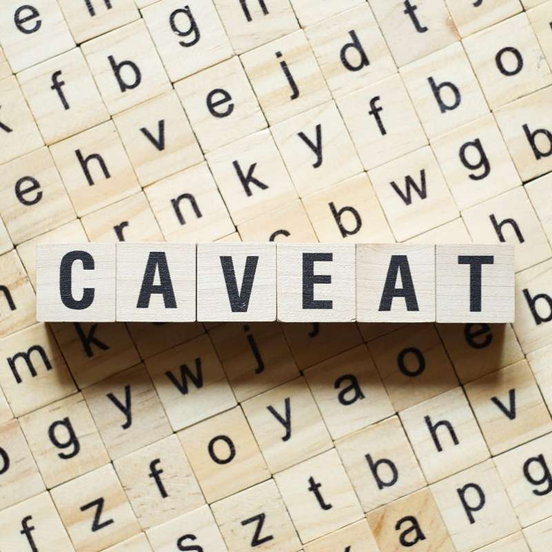

<!--- the "--8<--" html comments define what part of the README to add to the index page of the documentation -->
<!--- --8<-- [start:docs] -->


# CAVEAT

Deep generative models for human activity sequences. **ACT**ivity **VAE**s ~> **ACTVAE** ~> **CAVEAT**

[](https://github.com/fredshone/caveat/actions/workflows/daily-scheduled-ci.yml)
[](https://fredshone.github.io/caveat)

<!--- --8<-- [end:docs] -->

## Documentation

For more detailed instructions, see our [documentation](https://fredshone.github.io/caveat/latest).

## Installation

To install caveat, we recommend using the [mamba](https://mamba.readthedocs.io/en/latest/index.html) package manager:

### As a user
<!--- --8<-- [start:docs-install-user] -->


``` shell

mamba create -n caveat -c conda-forge -c city-modelling-lab caveat

```
<!--- --8<-- [end:docs-install-user] -->

### As a developer
<!--- --8<-- [start:docs-install-dev] -->
``` shell
git clone git@github.com:fredshone/caveat.git
cd caveat
mamba create -n caveat -c conda-forge -c city-modelling-lab --file requirements/base.txt --file requirements/dev.txt
mamba activate caveat
pip install --no-deps -e .
```
<!--- --8<-- [end:docs-install-dev] -->
For more detailed instructions, see our [documentation](https://fredshone.github.io/caveat/latest/installation/).

## Contributing

There are many ways to contribute to caveat.
Before making contributions to the caveat source code, see our contribution guidelines and follow the [development install instructions](#as-a-developer).

If you plan to make changes to the code then please make regular use of the following tools to verify the codebase while you work:

- `pre-commit`: run `pre-commit install` in your command line to load inbuilt checks that will run every time you commit your changes.
The checks are: 1. check no large files have been staged, 2. lint python files for major errors, 3. format python files to conform with the [pep8 standard](https://peps.python.org/pep-0008/).
You can also run these checks yourself at any time to ensure staged changes are clean by simple calling `pre-commit`.
- `pytest` - run the unit test suite and check test coverage.
- `pytest -p memray -m "high_mem" --no-cov` (not available on Windows) - after installing memray (`mamba install memray pytest-memray`), test that memory and time performance does not exceed benchmarks.

For more information, see our [documentation](https://fredshone.github.io/caveat/latest/contributing/).

## Building the documentation

If you are unable to access the online documentation, you can build the documentation locally.
First, [install a development environment of caveat](https://fredshone.github.io/caveat/latest/contributing/coding/), then deploy the documentation using [mike](https://github.com/jimporter/mike):

```
mike deploy develop
mike serve
```

Then you can view the documentation in a browser at http://localhost:8000/.


## Credits

This package was created with [Cookiecutter](https://github.com/audreyr/cookiecutter) and the [arup-group/cookiecutter-pypackage](https://github.com/arup-group/cookiecutter-pypackage) project template.